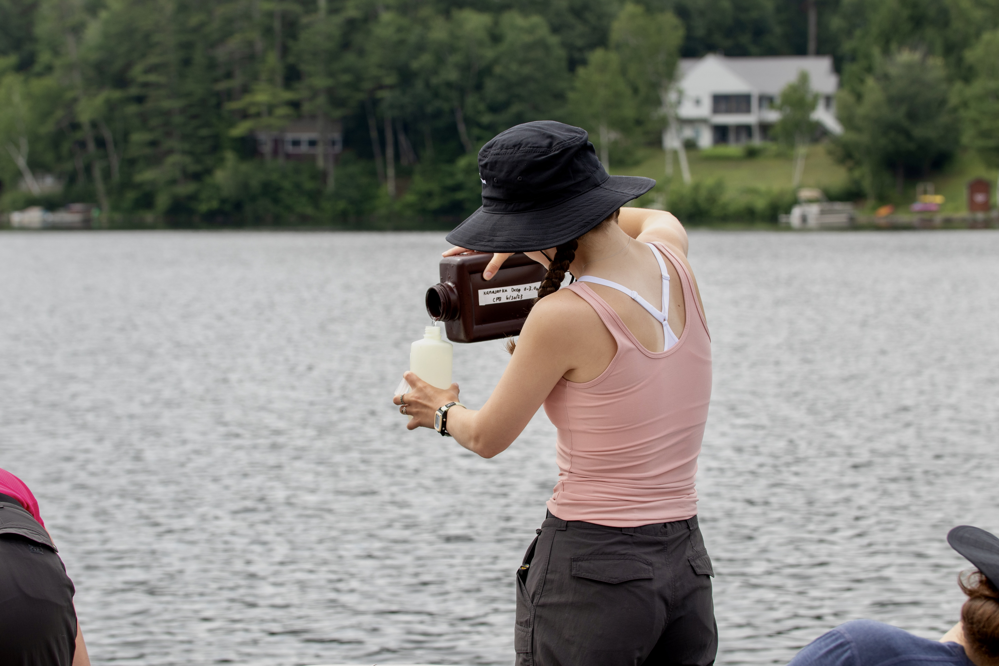
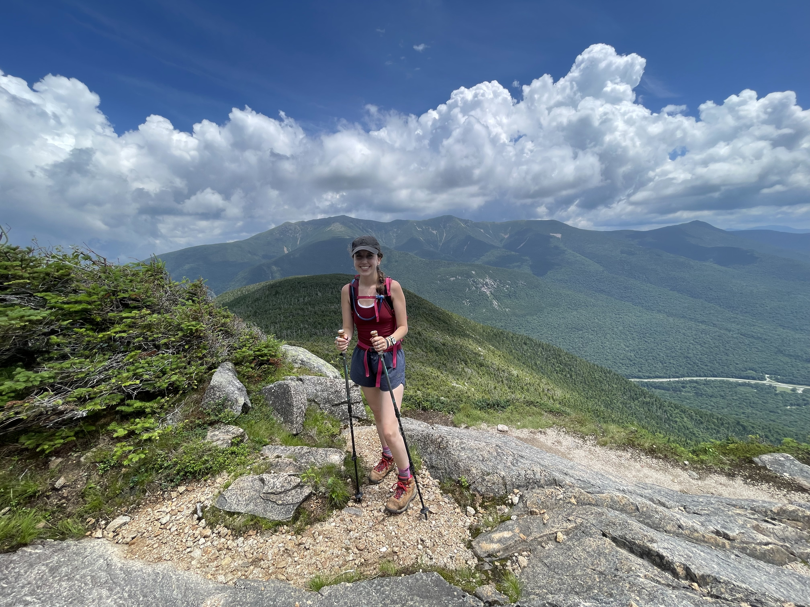
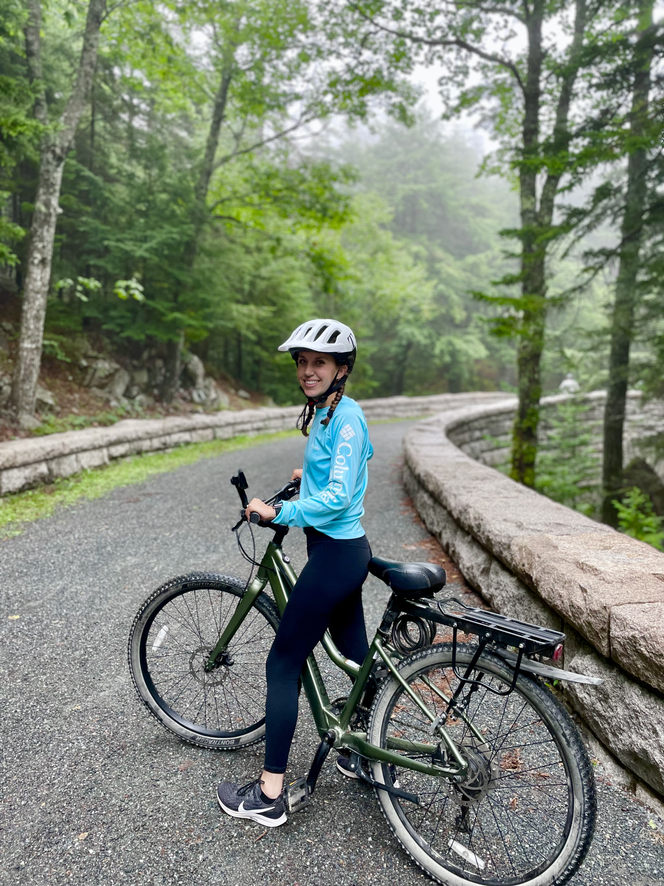

# About Me

I am a first year master's student studying Microbiology in [Dr. Anna O'Brien's lab](https://amob.github.io/). My research will primarily focus on the freshwater aquatic plant duckweed (*Lemna minor*) and its applications as a green manure in relation to its varying microbiomes. 

{width=50%}

I am also very interested in limnology. As an undergrad at UNH, I worked at the [Lakes Lay Monitoring Program](https://extension.unh.edu/natural-resources/land-conservation-water-resources/lakes-lay-monitoring-program) as a field/lab tech. I went out to various NH lakes and ponds to collect water samples, brought them back to the lab, and tested alkalinity, pH, color/chlorophyll-a, specific conductivity, CO2/DO levels, and turbidity. I also performed oxidative digestions to measure total phosphorus and total nitrogen concentrations in the samples. I loved this job!

{width=50%}

When I'm not working, I like to spend my time hiking, biking, and downhill skiing! I am on a mission to climb all 48 of NH's 4,000ft mountains, and so far I have hiked 19 of 48. My favorite place to ski is Cannon Mountain. My favorite place I have biked was at Acadia National Park. 

{width=50%}

{width=50%}

{width=30%}

