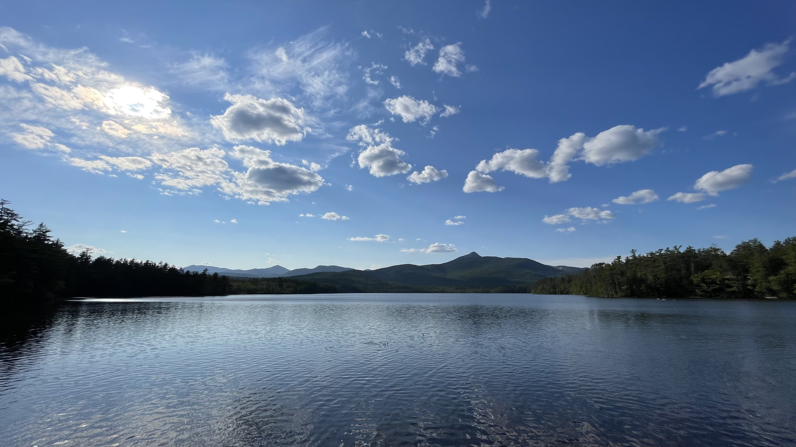

{width="20%"}

# Alyssa Daigle

#### University of New Hampshire

#### MS Student, [MCBS](https://colsa.unh.edu/molecular-cellular-biomedical-sciences)

###### [ alyssa.daigle[at]unh.edu ]

Hello! My name is Alyssa, and I am a master's student in Microbiology at the University of New Hampshire where I work with [Dr. Anna O'Brien](https://amob.github.io/). My research focuses on implementing duckweeds (aquatic plants) to uptake nutrients from agricultural runoff, and then harvesting the biomass to utilize as a green fertilizer. Specifically, I will study the interactions between duckweeds and toxic cyanobacteria that co-occur in the duckweed microbiome, and how these interactions influence the quality and safety of the green manure.

{width="70%"}

