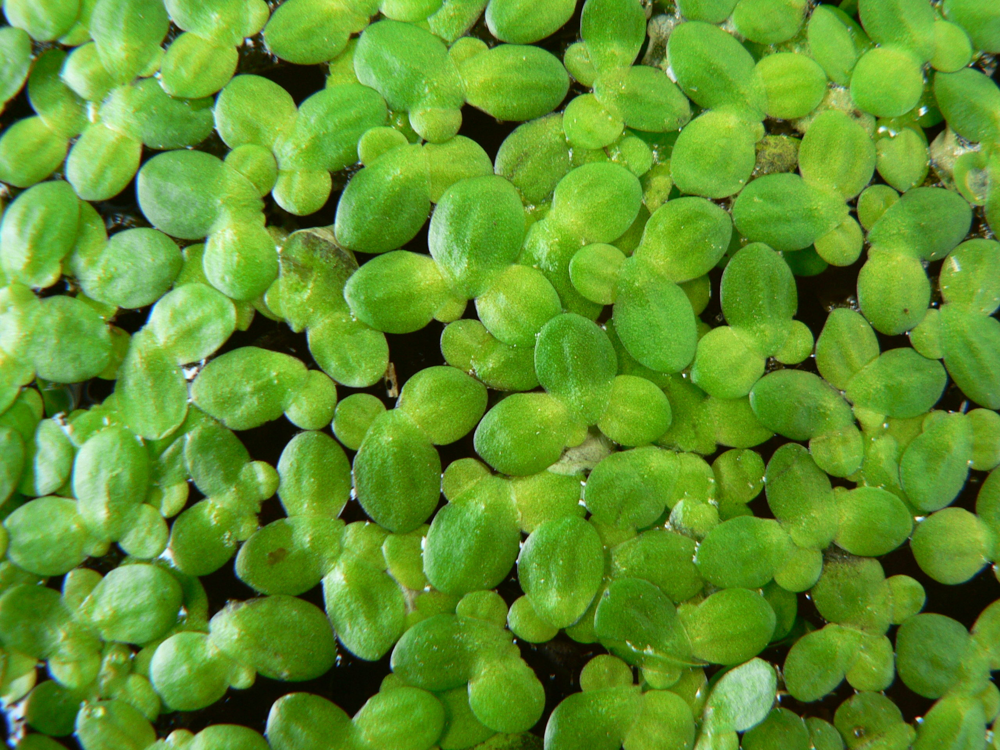

## Duckweeds as Green Manure
#### Implications of co-occurring cyanotoxins on manure quality

{width=50%}

Duckweeds are model organisms for many reasons. They have simple growth requirements, short generation times, and they proficiently sequester nutrients. These conditions make duckweeds a suitable candidate for green manure, as stated previously in the literature. 

What are the effects of the duckweed microbiome on the quality of the resulting manure? Do certain microbes result in a higher nutrient content? 
